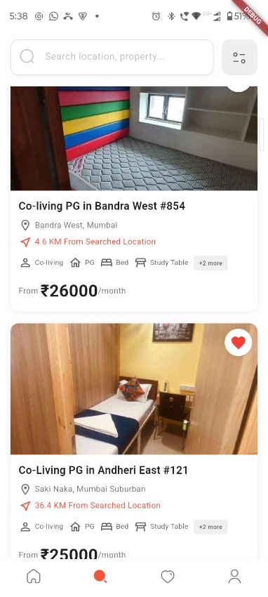
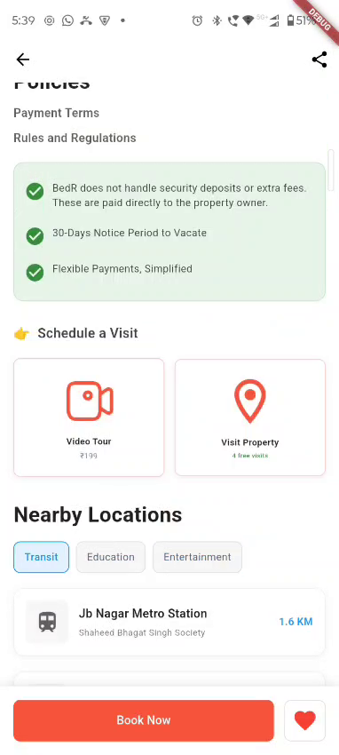
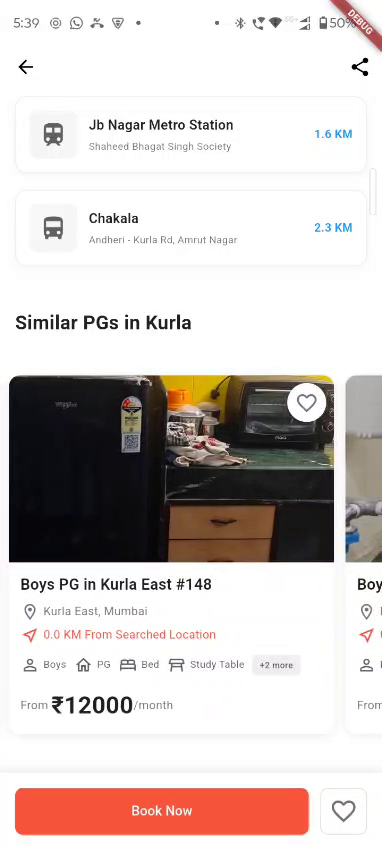
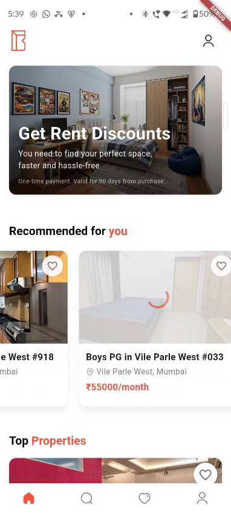

# Bedr - Room Rental App

A Flutter application for finding and booking rental rooms.

## Features

- Property listings with detailed information
- Search and filter functionality
- User authentication
- Favorites management
- Interactive property details
- Location-based services

## Screenshots

  
  
  
  
  

## Demo Video

📹 **[Download Demo Video](https://github.com/ananddub/bedr/raw/main/demo_video.mp4)**

## Getting Started

This project is a starting point for a Flutter application.

### Prerequisites

- Flutter SDK
- Dart SDK
- Android Studio / VS Code

### Installation

1. Clone the repository
2. Run `flutter pub get`
3. Run `flutter run`

## Architecture

- **Presentation Layer**: UI screens and widgets
- **Data Layer**: API clients and local database
- **Utility Layer**: Helper services and utilities

## Dependencies

- flutter_riverpod: State management
- drift: Local database
- dio: HTTP client
- go_router: Navigation
- cached_network_image: Image caching
- geolocator: Location services

For help getting started with Flutter development, view the
[online documentation](https://docs.flutter.dev/).
